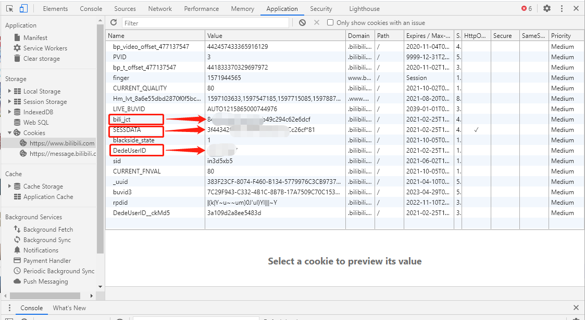
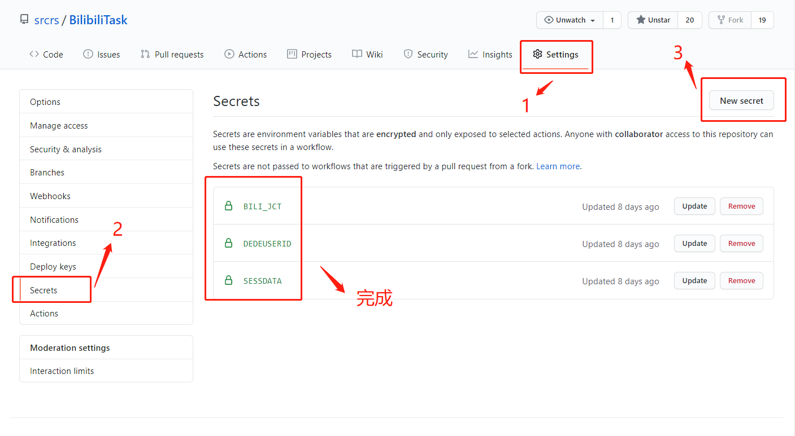
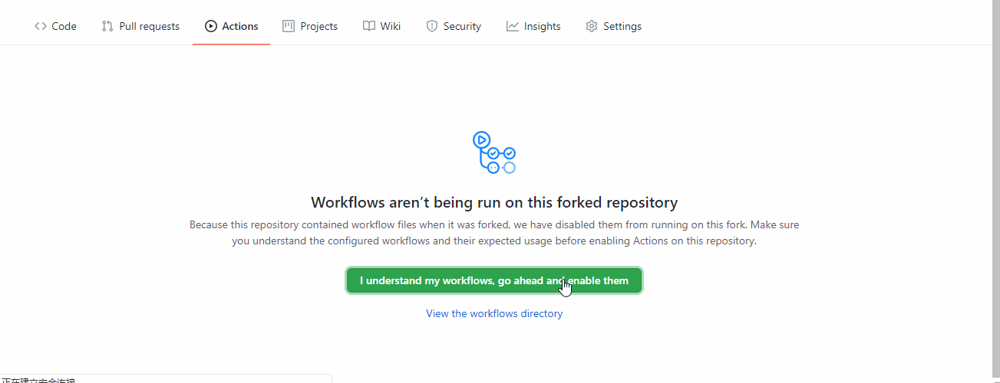
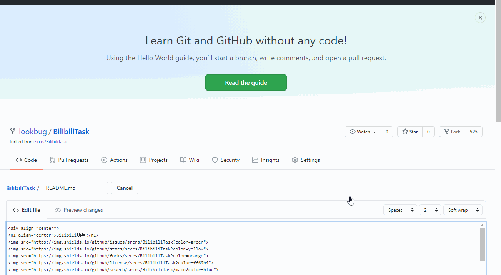
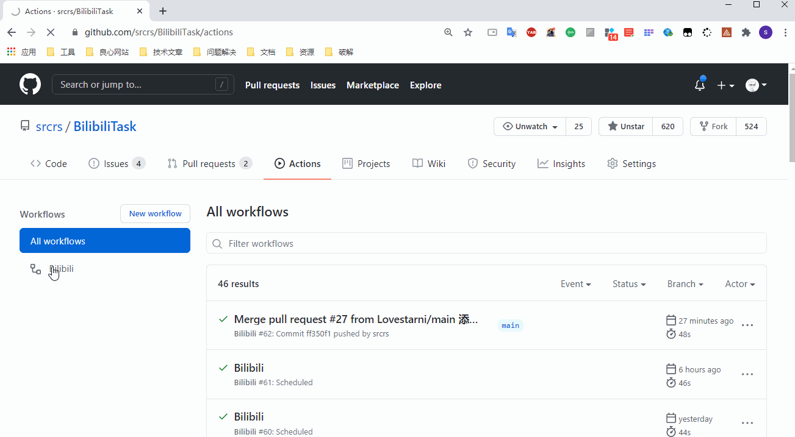
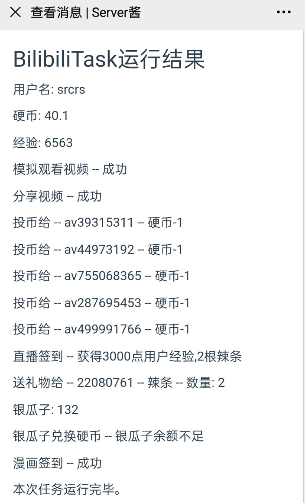

<div align="center"> 
<h1 align="center">Bilibili助手</h1>


</div>

# 简介

👯✨😄📫

哔哩哔哩(`B`站)自动完成每日任务，
投币，点赞，直播签到，自动兑换银瓜子为硬币，自动送出即将过期礼物，漫画`App`签到，大会员领取`B`币卷等。每天获得`65`点经验，助你快速升级到`Lv6`。

开源不易，如果本项目对你有帮助，那么就请给个`star`吧。

重要提示！！！

程序检测到礼物有效期还剩`1`天，将会自动随机送出，部分朋友包裹里可能会有贵重礼物，你可以手动关闭即将过期礼物送出功能。
需要在`config.yml`中，将`gift`项设置为`false`。详情见下方[配置文件说明](#配置文件说明)。

# 功能

* [x] 自动获取经验(投币、点赞、分享视频) 
* [x] 直播辅助(直播签到，自动送出即将过期的礼物) 
* [x] 自动兑换银瓜子为硬币 
* [x] 自动领取年度大会员每月权益(`B`币劵，权益礼包) 
* [x] 月底自动用B币卷给自己充电(每月`28`号)
* [x] 月底自动用B币卷兑换金瓜子(每月`28`号)
* [x] 漫画辅助脚本(漫画`APP`签到) 
* [x] 支持功能自定义(自定义投币数量，银瓜子兑换硬币开关等)
* [x] 账户失效提醒(会发送一条`actions`运行错误邮件)
* [x] 增加用`server`酱推送运行结果到微信

# 目录

- [简介](#简介)
- [功能](#功能)
- [目录](#目录)
- [使用方法](#使用方法)
  - [1.fork本项目](#1fork本项目)
  - [2.准备需要的参数](#2准备需要的参数)
  - [3.将获取到参数填到Secrets](#3将获取到参数填到secrets)
  - [4.开启actions](#4开启actions)
  - [5.进行一次push操作](#5进行一次push操作)
- [进阶使用](#进阶使用)
  - [配置文件说明](#配置文件说明)
  - [推送运行结果到微信](#推送运行结果到微信)
- [如何拉取最新代码](#如何拉取最新代码)
- [更新日志](#更新日志)
- [参考项目](#参考项目)

# 使用方法

## 1.fork本项目

项目地址：[srcrs/BilibiliTask](https://github.com/srcrs/BilibiliTask)

## 2.准备需要的参数

本项目成功运行需要三个参数，分别是`SESSDATA`，`bili_jct`，`DedeUserID`

- 打开`b`站首页（任意一个页面都行）--> 按下`F12` --> `Application` --> `Cookies` --> `https://www.bilibili.com`

- 找到所需要参数对应的数据，找不到可能是你的账号没有登录。



## 3.将获取到参数填到Secrets

在`Secrets`中的`Name`和`Value`格式如下：

Name | Value
-|-
BILI_JCT | xxxxx
DEDEUSERID | xxxxx
SESSDATA | xxxxx

将上一步获取的参数，填入到Secrets中，一共需要添加三个键值对。



## 4.开启actions

默认`actions`处于禁止状态，在`Actions`选项中开启`Actions`功能，把那个绿色的长按钮点一下。如果看到左侧工作流上有黄色`!`号，还需继续开启。



## 5.进行一次push操作

默认`push`操作会触发工作流运行。

+ 打开`README.md`，将里面的 😄 删除一个即可。



+ 查看`actions`，显示对勾就说明运行成功了。以后会在每天的`10：30`执行，自动完成每日任务。



# 进阶使用

## 配置文件说明

配置文件的位置在`src/main/resource/config.yml`。

符号 | 说明
-|-
coin | 代表投币的数量 [0,5]
gift | 是否需要送出即将过期礼物 [true,false]
s2c | 是否需要将银瓜子兑换硬币 [true,false]
autoBiCoin | 月底自动使用B币卷 [{0,自己有其他用途},{1,给自己充电},{2,兑换成金瓜子}]
platform | 用户设备的标识[android,ios]

```yml
coin: 5 #每天需要投币的数量。[0,5]。
gift: true #送出即将过期礼物。[true,false]
s2c: true #银瓜子兑换为硬币。[true,false]
autoBiCoin: 1 #月底自动使用B币卷。[{0,自己会使用},{1,给自己充电},{2,兑换成金瓜子}]
platform: android #用户设备的标识[android,ios]
``` 

## 推送运行结果到微信

使用`server`酱将程序运行结果推送到微信。

`server`酱官网：http://sc.ftqq.com

+ 按照`server`酱官网使用教程，用`github`登录并绑定微信。

+ 获得`SCKEY`并将其填入到`Secrets`中。

在`Secrets`中的`Name`和`Value`格式如下：

Name | Value
-|-
SCKEY | xxxxx

这样就可以在微信接收到运行结果了。



# 如何拉取最新代码

1、查看是否有源头仓库的别名和地址

```sh
$ git remote -v
origin  https://github.com/cmdcs/BilibiliTask.git (fetch)
origin  https://github.com/cmdcs/BilibiliTask.git (push)
upstream  https://github.com/srcrs/BilibiliTask (fetch)
upstream  https://github.com/srcrs/BilibiliTask (push)
```

`origin`是你的仓库地址，`upstream`是你`fork`的源头仓库。通常第一次是没有`upstream`的。

2、添加源头仓库

```sh
git remote add upstream https://github.com/srcrs/BilibiliTask
```

3、把上游仓库`main`分支的更新拉取到本地

```sh
git pull upstream main
```

4、将更新后的代码推送到你的仓库

```sh
git push origin main 
```

由于添加有配置文件`config.yml`，有可能会覆盖你自定义的`config.yml`，需要注意。

# 更新日志

## 2020-11-05

+ 根据阿里巴巴代码规范优化代码

+ 增加用户标识配置项

## 2020-11-03

+ 将自动使用B币卷开关，更改为自动配置用途，可以选择不使用、充电、兑换金瓜子。

+ 增加B币卷兑换金瓜子功能

## 2020-10-22

+ 增加用server酱推送运行结果到微信功能

## 2020-10-19

+ 增加年度大会员每月`1`号领取`B`币卷

+ 月底自动用`B`币卷给自己充电

+ 在配置项中添加是否月底用`B`币卷给自己充电开关，默认开启

由于我本身不是年度大会员，无法测试是否可以正常领取年度大会员权益和`B`币卷，
出错的时候麻烦给我提一个`issues`，我会及时解决的。

## 2020-10-17

+ 优化日志显示

+ 增加账户失效提醒

账户失效会导致任务流运行失败，github会下发运行失败邮件提醒。

## 2020-10-13

+ 重构代码，功能不变

+ 采用反射实现自动加载`task`包功能任务代码。

+ 加入配置文件，用户可自定义一些配置

## 2020-10-08

+ 增加自动送出即将过期的礼物

+ 增加漫画`APP`签到

+ 增加一些`api`

## 2020-10-07

+ 增添银瓜子自动兑换硬币功能

## 2020-10-06

+ 增添B站直播签到

+ 继续增添`API`

## 2020-10-05

+ 完成了自动获取经验功能

每日登录、每日观看视频、每日投币、每日分享

+ 完善对接`api`接口

# 参考项目

[happy888888/BiliExp](https://github.com/happy888888/BiliExp)
